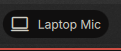
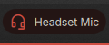
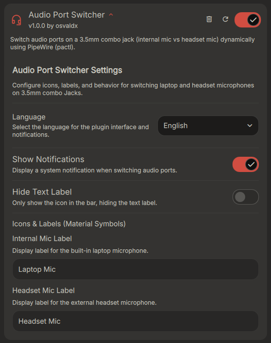

# Audio Port Switcher / Conmutador de Puertos de Audio

### [English]
A simple widget for Dank Material Shell (DMS) to switch the microphone input between your laptop's internal mic and a headset mic with one click.

### Features
* **Automatic source detection:** It finds your active PipeWire source device automatically, no hardcoded IDs needed.
* **Instant updates:** If you plug or unplug your headset, the bar icon updates right away.
* **Native DMS look:** Hover effects, rounded corners, and click actions work natively with the rest of your bar widgets.

### Dependencies
You need to have `pipewire` and `pulseaudio-utils` (for the `pactl` command) installed on your system.

### How to install
1. Copy the `audioPortSwitcher` folder to `~/.config/DankMaterialShell/plugins/`.
2. Add `"audioPortSwitcher"` to the `leftWidgets`, `centerWidgets`, or `rightWidgets` list in your `settings.json` file.

---

### [Español]
Un widget simple para Dank Material Shell (DMS) que te permite cambiar la entrada de micrófono entre el mic interno de la notebook y el del auricular con un solo clic.

### Características
* **Detección automática:** Encuentra la entrada activa de PipeWire automáticamente, sin IDs fijas en el código.
* **Actualización al instante:** Si conectás o desconectás el auricular, el icono de la barra cambia en el acto.
* **Diseño nativo de DMS:** El efecto hover, los bordes redondeados y el clic se integran de forma nativa con los otros widgets de la barra.

### Dependencias
Necesitás tener instalado `pipewire` y `pulseaudio-utils` (para usar el comando `pactl`).

### Cómo instalarlo
1. Copiá la carpeta `audioPortSwitcher` en `~/.config/DankMaterialShell/plugins/`.
2. Sumá `"audioPortSwitcher"` a la lista de `leftWidgets`, `centerWidgets` o `rightWidgets` en tu archivo `settings.json`.

---

## Previews / Previsualizaciones

| Laptop Mic / Mic de Laptop | Headset Mic / Mic de Auricular |
| :---: | :---: |
|  |  |

| Settings / Ajustes |
| :---: |
|  |